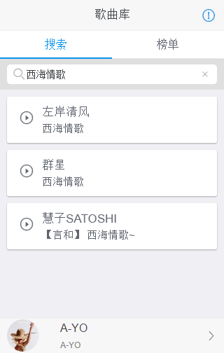

## vue-router-music

> 基于百度音乐接口的简单音乐播放器--悦动

- tech.

    - [vue 2.x](https://cn.vuejs.org/v2/guide/)
    - [vue route 2.x](http://router.vuejs.org/zh-cn/index.html)
    - [sui mobile](http://m.sui.taobao.org/components/)
    - [less](http://lesscss.cn/) 

- func
    
    - 多用户同步点歌
    - 聊天室

----

1. 安装依赖

    `npm install`
    
    `npm install webpack -g`
    
2. 编译打包改动的文件

    `webpack --watch`
    
3. 启动服务器

    - 通过命令
        
        `cd server-src`
        
        `node app.js 5369`
        
    - 或者直接运行 [start.bat](start.bat) 文件
    
        >  端口由  [port.txt](port.txt) 文件指定
        
        > 运行 [start-with-chrome-appmode.bat](start-with-chrome-appmode.bat) 文件，打开chrome app 模式
    
    
4. 访问 [http://localhost:5369/](http://localhost:5369/)

5. 效果预览

      
    
    
    

