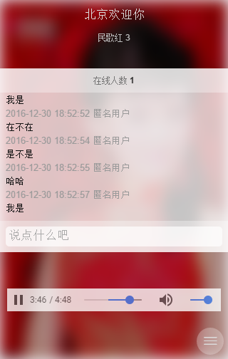
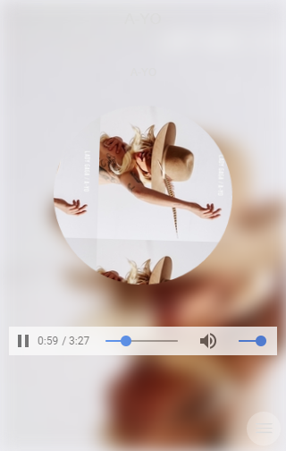

## vue-router-music

> 基于百度音乐接口的简单音乐播放器

- [vue 2.x](https://cn.vuejs.org/v2/guide/)
- [vue route 2.x](http://router.vuejs.org/zh-cn/index.html)
- [sui mobile](http://m.sui.taobao.org/components/)
- [less](http://lesscss.cn/) 

----

1. 安装依赖

    `npm install`
    
    `npm install webpack -g`
    
    `npm install webpack-dev-server -g`
    
2. 启动webpack-dev-server 并自动编译打包改动的文件

    `webpack-dev-server`
    
3. 部署

    `cd server-src`
    
    `node app.js`
    
    > 访问 [http://localhost:8080/](http://localhost:8080/)
    
 

